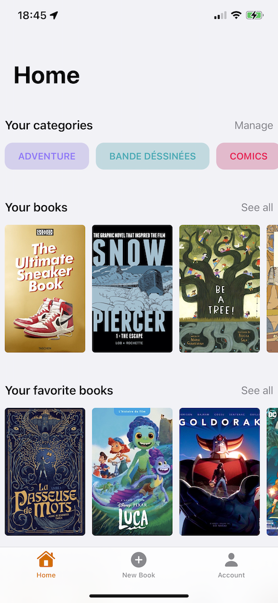
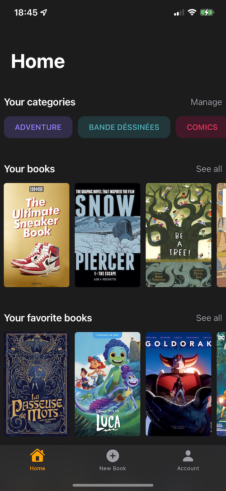
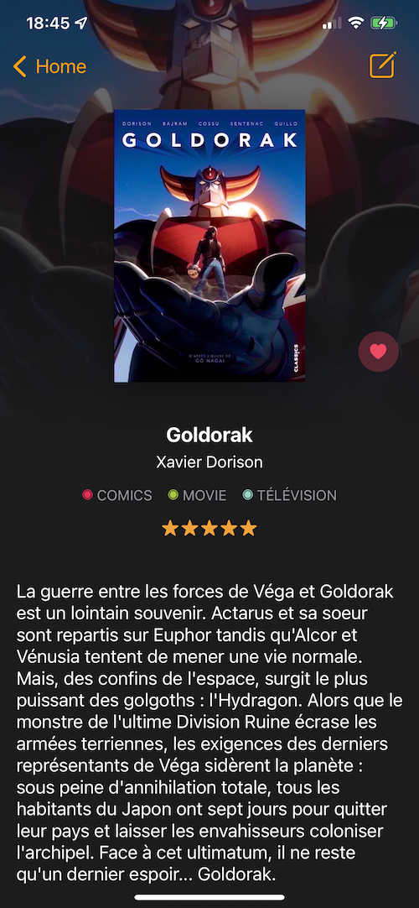
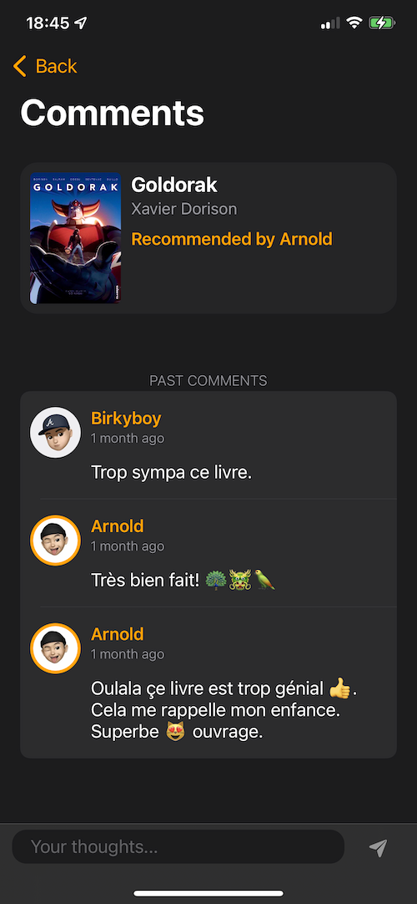
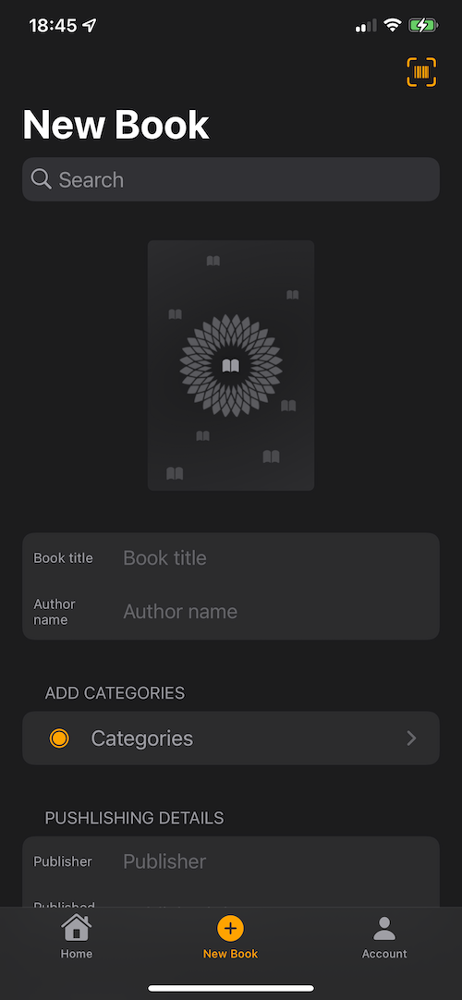
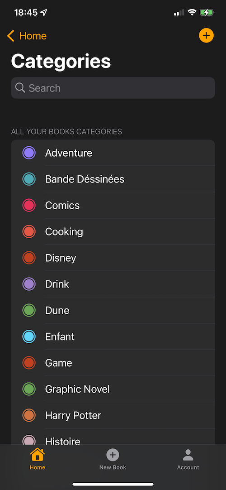
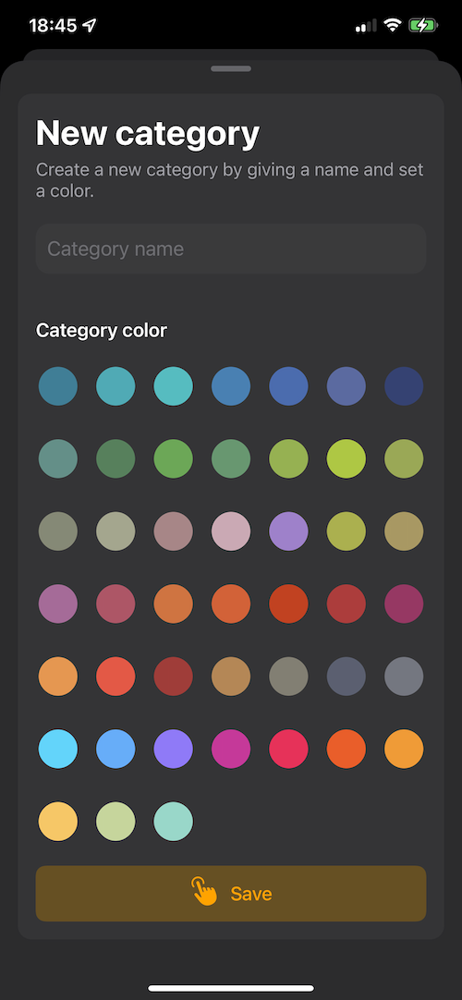
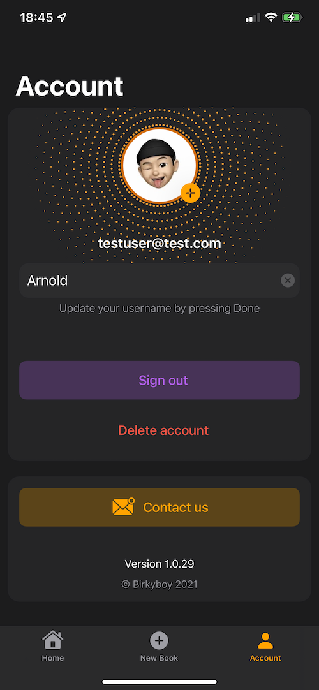

# MyLibrary
OpenClassrooms P12 - Projet final.

Créer une application iOS pour répondre à un besoin autour de vous. 
Elle peut permettre d'adopter des chiens abandonnés, de localiser et référencer les objets trouvés pendant un festival,
d'aider à maîtriser ses dépenses énergétiques… Prenez le temps de choisir un sujet qui vous touche et pour lequel il existe un véritable besoin.

Contraintes
Le code est sur GitHub avec un historique de commits cohérent.
Le code est documenté avec des commentaires pour chaque fonction, propriété, classe au minimum.
Le code est écrit en anglais : commentaires, variables, fonctions…
Le projet ne contient aucun warning ni erreur.
Vous avez respecté le modèle MVC scrupuleusement.
Votre application doit contenir des tests unitaires qui couvriront la majorité de la logique de votre code.
L'application doit s'afficher correctement sur toutes les tailles d'iPhone (ou iPad) en mode portrait (ou paysage)
L'application doit supporter iOS 10 et les versions supérieures.
Votre projet doit être diffusé publiquement avec un code source ouvert.

MaBibliothèque

Dans le cadre du projet final du parcours iOS, la mission est de créer une application à but social et répondre à un veritable besoin.

Le choix de mon sujet s’est imposé lors de conversations avec des gens autour de moi qui ont tous un large volume de livres.

J’ai proposé l’idée de construire une application pouvant répertorier leur collection. 
S’adressant à tous les ages et tout type d’ouvrages, du livre de collection aux comics, cette application permettra d’avoir avec sois dans son téléphone ou iPad ce que l’on possède deja.
Fini de se dire au moment d’un achat si on possède deja tel ou tel livre.
L’utilisateur en manque d’inspiration pour faire un cadeau, pourra puiser des idées dans la section recommendation tout en se laissant guider par les commentaires et avis des autres utilisateurs.

Le parcours d’un nouvel utilisateur commencera par un écran de bienvenue présentant la possibilité de se connecter à son compte ou d’en créer un.

L’application proposera ensuite, 3 onglets principaux pour la version iPhone:
• Un onglet Accueil centralisera les 20 derniers livres ajoutés, les favoris et les catégories de
l’utilisateur ainsi que les derniers livres recommandés par la communautés
Le bouton Tout Voir permettra d’afficher la collection complète de l’utilisateur.
Un menu d’options donnera la possibilité de changer l’ordre de classement (par date d’ajout, titre, auteur etc..) et de changer la taille des couvertures.

• Un onglet d'ajout de Nouveau livre, donnera la possibilité de remplir les informations manuellement, de faire une recherche en ligne en fournissant des mots clés (titre, nom d’auteur ou un code ISBN). Un button permettra d’ouvrir une fenêtre pour scanner un code barre et faire un recherche à partir de ce code.

• Un onglet Compte permettra de changer le nom d’utilisateur, la photo et de contacter le développeur. L’utilisateur pourra également se déconnecter ou effacer son compte.

La version iPad proposera l’accès à toutes ces fonctions en un écran central type dashboard.
En cliquant sur une couverture, une vue détaillée contenant toutes les informations du livre sera présentée. Si l’ouvrage appartient à l’utilisateur, il pourra éditer et modifier les informations ainsi que la couverture.

Un bouton Recommander permettra de partager le livre avec les autres utilisateurs et apparaîtra dans la liste des livres recommandés.
Un écran de commentaires pour lire ou partager des avis sur le livre sera accessible.
Tous les utilisateurs ayant posté un commentaire sur le livre recevront une notification lors de l’ajout d’un nouveau message.

L’écran des catégories, accessible depuis l’onglet Accueil ou Nouveau livre, permettra de créer, éditer, et effacer des catégories.

L’application sera disponible en Français et en Anglais pour iPhone en orientation portrait et iPad en orientation portrait et paysage.

       
